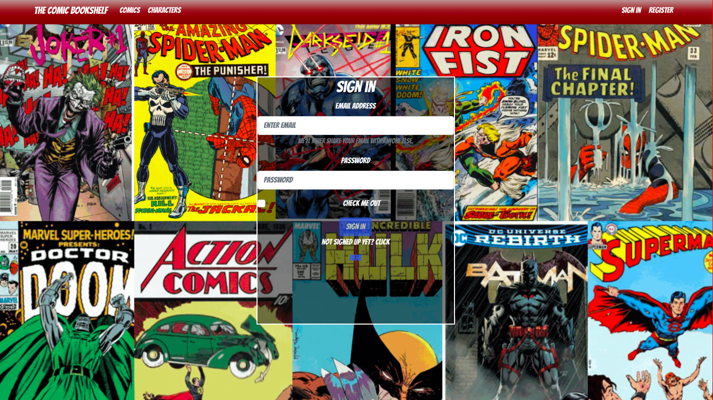
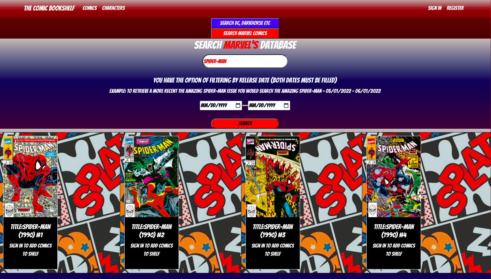
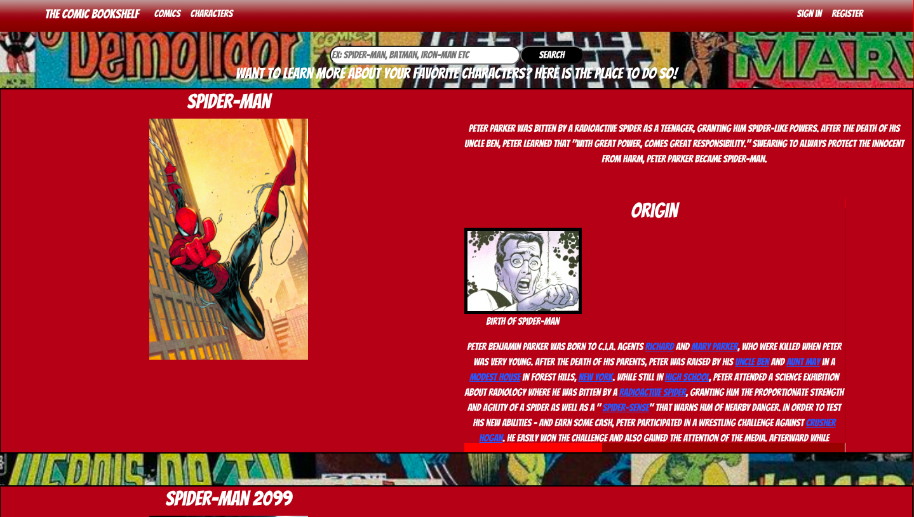
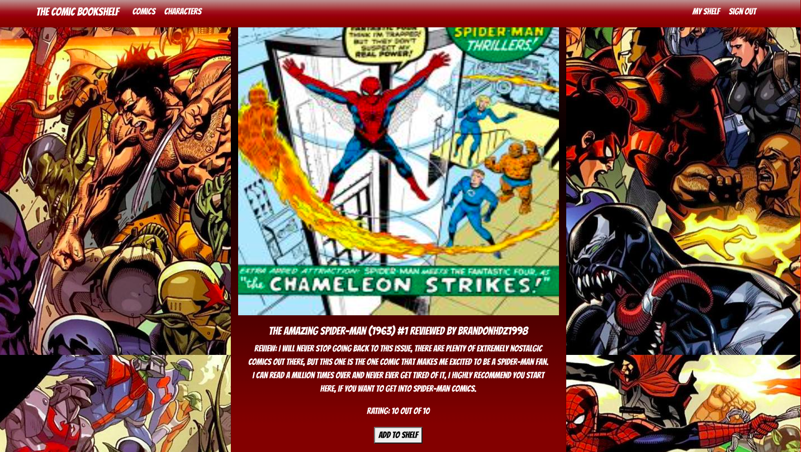

# The Comic Bookshelf V2

## Date: 6/06/2022

### By: Brandon Hernandez

#### [Website](https://portfolio-v2-lht5v21ap-brandonhernandez123.vercel.app/) | [GitHub](https://github.com/brandonhernandez123) | [LinkedIn](https://www.linkedin.com/in/brandonhdzgtz/)

### ***Description***
#### The Comic Bookshelf V2 is a comic book tracking app where you can search ComicVine's Database or Marvel's database and track your comic books as well as review them. You can view other users reviews and add the comics they recommended to your shelf. You can also search Comic Book Characters and read detailed descriptions on those characters.
***

### ***Technologies Used***
* Nodejs / Express / PostgreSQL 
* React js
  * HTML
  * CSS
  * Javascript
* Bcrypt / JWT
* Bootstrap
***

### ***Getting Started***

##### Sign up and sign in as a new user, you will be routed to the search comics page where you can search and begin adding to your shelf

##### The project itself was deployed and can be viewed [here](https://thecomicbookshelfv2.herokuapp.com/).
***

### ***Screenshots***

##### Login page

##### Search Comics page

##### Search Characters page

##### Review feed

***

### ***Future Updates***

- [ ] Add followers
- [ ] View other user's shelf
- [ ] Update styling 
- [ ] Add Messaging feature
***

### ***Credits***

##### ComicVine API: [ComicVine](https://comicvine.gamespot.com/api/)

##### Marvel API: [Marvel](https://developer.marvel.com/)

##### Background images: [Google](Google.com)
***